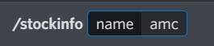
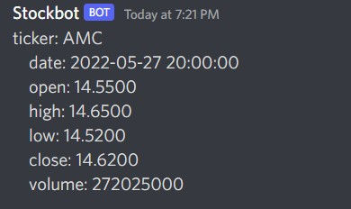
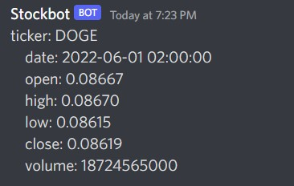

# Stock & Crypto Info Discord Bot
Displays stock and crypto price info on Discord from the Alpha Vantage API.

## Environment Variables Needed
<ul>
    <li>TOKEN - obtained from your bot at <a href="https://discord.com/developers/applications">Link</a></li>
    <li>GUILD_ID - obtained from copying the id of your server while in developer mode</li>
    <li>APP_STOCK_API - obtained from Alpha Vantage</li>
</ul>

## Stock API Key
An API key is needed to retrieve stock and crypto data.
You can rename .env.temp to .env and enter your own API key. You can get an API key at https://www.alphavantage.co/.

## Run Program
<ol>
    <li>npm install</li>
    <li>npm start</li>
</ol>

## Bot Commands
<ul>
    <li>/stockinfo 'name of stock'</li>
    <li>/cryptoinfo 'name of crypto'</li>
</ul>

## Screenshots

 

  

 

