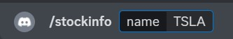
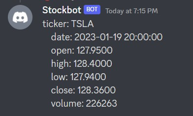
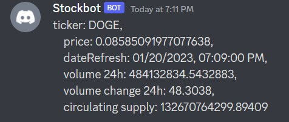

# Stock & Crypto Info Discord Bot
Displays stock and crypto price info on Discord from the Alpha Vantage API.

## Environment Variables File
<ul>
    <li>Change .env.temp to .env</li>
    <li>TOKEN - obtained from your bot at <a href="https://discord.com/developers/applications">Link</a></li>
    <li>GUILD_ID - obtained from copying the id of your server while in developer mode</li>
    <li>APP_STOCK_API - obtained from <a href="https://www.alphavantage.co/">Alpha Vantage</a></li>
    <li>COIN_MARKET_CAP_API - obtained from <a href="https://coinmarketcap.com/api/">CoinMarketCap</a></li>
</ul>

## Run Program
<ol>
    <li>npm install</li>
    <li>npm start</li>
</ol>

## Bot Commands
<ul>
    <li>/stockinfo 'name of stock'</li>
    <li>/cryptoinfo 'name of crypto'</li>
</ul>

## Screenshots

 

  

 

